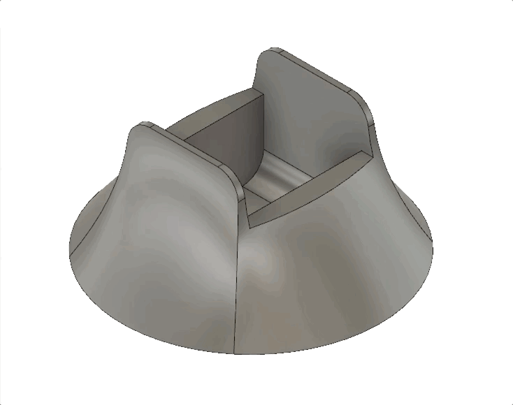
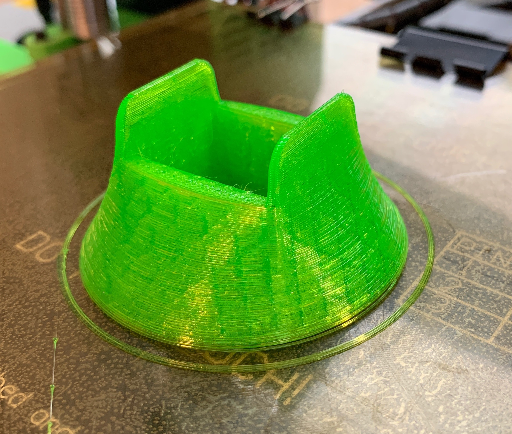
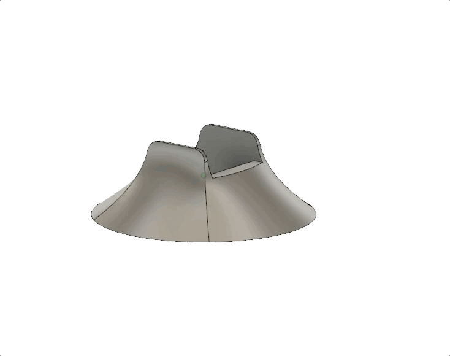
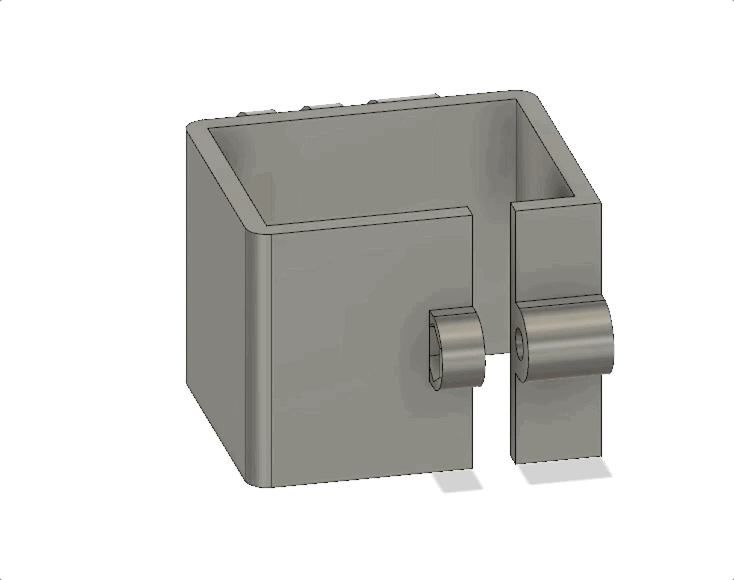

# DJI Osmo Pocket accessory designs

3D models of accessory designs for the DJI Osmo Pocket.

## Printing

Recommend printing all of these with flexable filament such as TPU.

## Accessories

### Base (small)

Base for stability. Can hold Osmo Pocket upright or horizontally.

### Base (wide)

Wider base for stability. Can hold Osmo Pocket upright or horizontally.

### GoPro Mount

Pinch mount with GoPro compatible fingers. 
Pinch mechanism requires an M3 nut and [M3x16mm thumb screw](https://www.mcmaster.com/92552A418)

